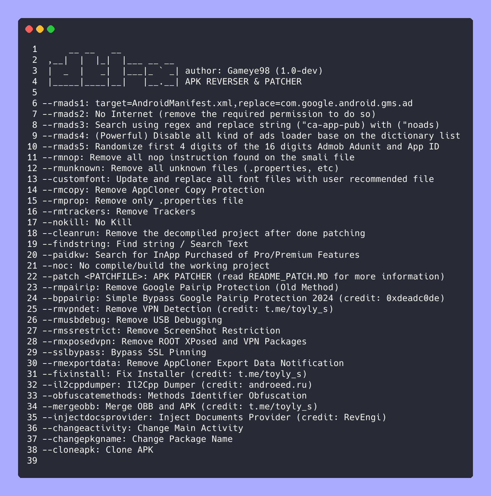

[](https://github.com/Gameye98/DTL-X/stargazers)
[](https://github.com/Gameye98/DTL-X/network/members)
[](https://github.com/Gameye98/DTL-X/issues)
[](https://github.com/Gameye98/DTL-X/watchers)
[](https://www.python.org)
[](https://www.gnu.org/software/bash/)
[](https://opensource.org/licenses/MIT)
[](https://github.com/BlackHoleSecurity)
[](https://github.com/Gameye98)

[](https://github.com/Gameye98)  

[](https://github.com/BlackHoleSecurity)

# DTL-X
An Advanced Python APK Reverser and Patcher Tool.  

The purpose of the DTL-X is to provide a Python-based tool for reversing and patching Android applications (APKs). The tool can be used to remove ads, trackers, and other unwanted code from APKs. It can also be used to modify the behavior of APKs, such as by adding new features or changing the permissions that the app requires.

The DTL-X tool is based on the apktool and smali tools. It uses these tools to decompile an APK into its original source code, which can then be modified. The tool also includes a number of features that make it easier to reverse and patch APKs, such as a graphical user interface and a built-in decompiler.

The DTL-X tool is a powerful tool for anyone who wants to reverse or patch Android applications. It is easy to use and can be used to modify APKs in a variety of ways. The tool is also open source, so it can be modified and extended by anyone.

Here are some of the features of DTL-X:

* Remove ads  
* Remove trackers  
* Modify behavior  
* Add new features  
* Change permissions  
* Graphical user interface  
* Built-in decompiler  
* Open source  

If you are interested in reversing or patching Android applications, then I recommend checking out the DTL-X tool. It is a powerful and easy-to-use tool that can be used to modify APKs in a variety of ways.  
```bash
--rmads1: target=AndroidManifest.xml,replace=com.google.android.gms.ad  
--rmads2: No Internet (remove the required permission to do so)  
--rmads3: Search using regex and replace string ("ca-app-pub) with ("noads)  
--rmads4: (Powerful) Disable all kind of ads loader base on the dictionary list  
--rmnop: Remove all nop instruction found on the smali file  
--rmunknown: Remove all unknown files (.properties, etc)  
--customfont: Update and replace all font files with user recommended file  
--rmcopy: Remove AppCloner Copy Protection  
--rmprop: Remove only .properties file  
--rmtrackers: Remove Trackers  
--nokill: No Kill  
--cleanrun: Remove the decompiled project after done patching  
--findstring: Find string / Search Text  
--paidkw: Search for InApp Purchased of Pro/Premium Features  
--noc: No Compile  
--patch <PATCHFILE>: APK PATCHER (read README_PATCH.MD for more information)
--rmpairip: Remove Google Pairip Protection (Old Method)  
--rmvpndet: Remove VPN Detection  
--rmusbdebug: Remove USB Debugging  
--rmssrestrict: Remove Screenshot Restriction  
--rmxposedvpn: Remove ROOT XPosed and VPN Packages  
--sslbypass: Bypass SSL Pinning [STILL WORKING ON]
--rmexportdata: Remove AppCloner Export Data Notification  
```

**• note 1: remove any whitespace found on the apk file name before patching**  
**• note 2: you can use multiple method in a single run:**  
`python dtlx.py --rmprop --rmads4 --cleanrun file.apk`  
**• note 3: remember the execution of method start from left to right, based on the above command: remove .properties then remove ads**  
**• note 4: if you want to update to the latest version just type:**  
`git pull .`

## Screenshot


### Requirements
• python 3.x  
• aapt & aapt2 (patched version, could be found on assets/)  
• apksigner  
• openjdk  
• progressbar (python's library)  
• unzip  
• zip  

### Installation
```bash
# On termux, u can run:
bash termux_install.sh
# On Linux Distribution:
bash linux_install.sh
```

#### Follow Our Channel or Join Our Discussion
- [BlackHole Security Org](https://github.com/BlackHoleSecurity)  
- [Schadenfreude Discussion](https://t.me/schdenfreude)  
- [Schadenfreude Channel](https://t.me/schdnfrd)

#### Credits
- **aapt & aapt2 (patched version) from Apktool M**
