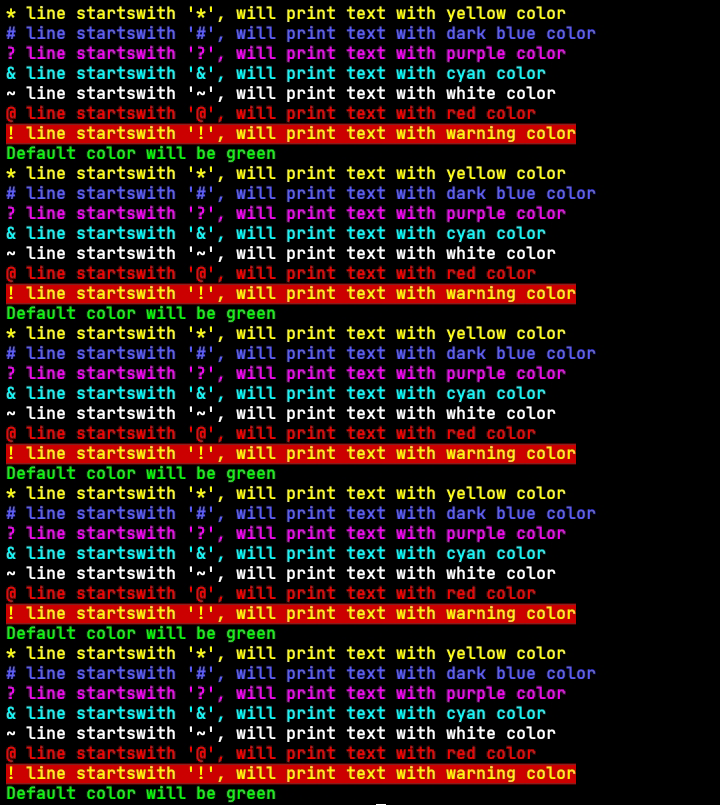

# PATCH Helper
The "Patch Blocks" feature is important if you want to modify specific parts of an APK without decompiling or manually editing code.  
It allows you to apply predefined patches or make targeted changes to an app's behavior, such as removing ads, unlocking features, or altering permissions.  
This feature is particularly useful for quick, non-intrusive edits but requires caution, as unauthorized modifications may violate terms of service or local laws.  

### mypatch.zip structure
```plaintext
mypatch/
├── file.bin
└── patch.txt
1 directory, 2 files
```

* Supported text colors (default theme):


* List of blocks supported in DTL-X
```patch
[BEGIN]
* Author: Gameye98
! Remember to repair dex after u patch classes*.dex with [CLASSES]
# You can put text anywhere u want
[ADD_FILE]
@ If your text contains { and double quote, DTLX will recognize it as json
{"file_name": "file.bin"}
{"to": "assets/"}
[DELETE_FILE_IN_APK]
{"folder_name": "assets/file.bin"}
[DELETE_FOLDER_IN_APK]
{"folder_name": "assets/sounds"}
[RENAME_FILE_IN_APK]
{"file_name": "assets/file.bin"}
{"to": "assets/newname.bin"}
[CLASSES]
* the other way around with this is that, u can put method only
* like this:
* "methodname:()Z"
{"class_name": "com.classname.methodname:()Z"}
{"replaced": "12 10 0f 00"}
[PATCHLIB]
{"file_name": "lib/arm64/libexample.so"}
{"offset": "0x60223c"}
{"replaced": "90 90 90 90"}
[END]
```
